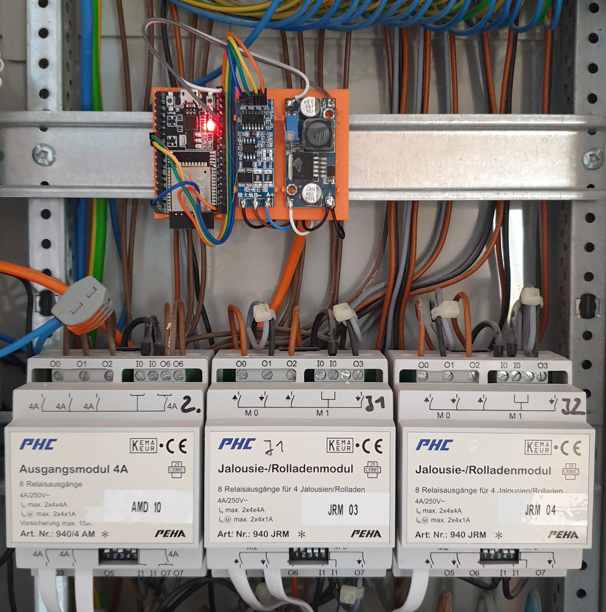

# ESPHome-PHC-Controller

This project implements a PHC Controller which integrates into [Home Assistant](https://home-assistant.io) through [ESPHome](https://esphome.io). This could replace a existing dumb controller (STM - Steuermodul), thus smartifying a existing Phea PHC installation.

# Demo installation

Smart PHC controller with PHC-Modules. A close up of the board containing the ESP32 with the RS-485 converter and a step-down module can be found [here](esp_board.jpg).

# Requirements

ESPHome 2022.11 or lower (see timing requirements).

This project has been developed and tested on a ESP32. A ESP8266 is probably going to work just fine.

The PHC-Bus is RS-485 based. In order communicate on the bus a RS-485 TTL Adapter is required. Currently only a Chip with automatic flow control has been tested.
Connect the A/B wires to the PHC-bus. This can easily be done using the screw-terminal on the power-supply ([see](power_supply.jpg)).
Finally connect the RS-485 adapter to your ESP and you are good to go.

With the help of a step-down module/voltage converter the 24V supplied by the PHC-power-supply can be used to power the ESP.

Make sure to remove any 
existing controllers (STM - Steuermodul) from the bus, as they will interfere. 

# Timing requirements
The original PHC implementation sends acknowledgement messages with a `250us` delay. This component implements the same delay.
On ESPHome versions prior to 2022.12 this does work. With the help of an oscilloscope you can verify the delay. ESPHome versions newer than 2022.11 increase the delay, rendering the system almost unusable. The specific reason for this problem is not yet known.

On newer ESPHome versions one possible workaround is to use an older version of the Arduino framework.
This can be achieved by adding the following version and platform version to the configuration file.

```yaml
esp32:
  board: esp32dev
  framework:
    type: arduino
    # The timing is incorrect on new arduino versions or IDF based firmware
    version: 1.0.6
    platform_version: 3.5.0
```

# Configuration variables

A example configuration can be found [here](example.yaml)

## PHC Controller
- **id**(**Required**, string): Controller ID which will be used for entity configuration.
- **uart_id**(**Required**, string): ID of the UART-Component connected to the PHC-Bus

## AMD(Output module/Ausgangsmodul) as switch
- **phc_controller_id**(**Required**, string): The PHC-Controller to which this entity belongs
- **address**(**Required**, int): Module DIP-Switch address
- **channel**(**Required**, int): Output channel on the Module
- All other options from [Switch](https://esphome.io/components/switch/index.html#config-switch)

## AMD(Output module/Ausgangsmodul) as light
- **phc_controller_id**(**Required**, string): The PHC-Controller to which this entity belongs
- **address**(**Required**, int): Module DIP-Switch address
- **channel**(**Required**, int): Output channel on the Module
- All other options from [Light](https://esphome.io/components/light/index.html#config)

## EMD(Input module/Eingangsmodul) Output as light
- **phc_controller_id**(**Required**, string): The PHC-Controller to which this entity belongs
- **address**(**Required**, int): Module DIP-Switch address
- **channel**(**Required**, int): Output channel on the Module
- All other options from [Light](https://esphome.io/components/light/index.html#config)

## EMD as binary sensor
- **phc_controller_id**(**Required**, string): The PHC-Controller to which this entity belongs
- **address**(**Required**, int): Module DIP-Switch address
- **channel**(**Required**, int): Output channel on the Module
- All other options from [Binary Sensor](https://esphome.io/components/binary_sensor/index.html#config)

## JRM(Blinds-Module/ Jalousie-Rolladen Modul)
- **phc_controller_id**(**Required**, string): The PHC-Controller to which this entity belongs
- **address**(**Required**, int): Module DIP-Switch address
- **channel**(**Required**, int): Output channel on the Module
- **max_open_time**(Optional, Time): Determines for how long the Output will be enabled while opening. This value should guarantee the cover reaches it's open state. Defaults to `30s`.
- **max_close_time**(Optional, Time): Determines for how long the Output will be enabled while closing. This value should guarantee the cover reaches it's closed state. Defaults to `30s`.
- **assume_position**(Optional): Assume the covers position based on measured open/close times
    - **open_time**(**Required**, Time): The time it takes to open the cover completely from it's closed state. Must be smaller than `max_open_time`.
    - **close_time**(**Required**, Time): The time it takes to close the cover completely from it's opened state. Must be smaller than `max_close_time`.

- All other options from [Cover](https://esphome.io/components/cover/index.html#config)


# Related work
Without previous reverse engineering work done by others this would have been a lot more time consuming.

- [PHC-Protokoll](https://www.phc-forum.de/media/kunena/attachments/253/PHC-Protokoll.pdf)
- [Openhab PHC](https://github.com/openhab/openhab-addons/blob/da59cdd255a66275dd7ae11dd294fedca4942d30/bundles/org.openhab.binding.phc/src/main/java/org/openhab/binding/phc/internal/handler/PHCBridgeHandler.java)

# Throubleshooting
- The UART debug function can be used to analyze communication on the bus.
- Kown Memory Issues:
    - ESP8266 out-of-memory exception
    - Guru Meditation Error: exception caused by `LOOP_STACK_SIZE` exceeded
        - [solution](https://community.platformio.org/t/esp32-stack-configuration-reloaded/20994/2)